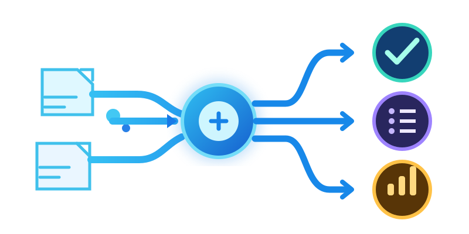

<p align="center">
  
</p>

# PSAIOpenAIDecisions

## About

**PSAIOpenAIDecisions brings OpenAI's Decisions API into PowerShell pipelines.**

Ask named predicate, choice, and score questions about text or structured PowerShell input. The module returns typed answers alongside the original input, with commands to test, filter, rank, route, annotate, tag, and compare items. It is a PowerShell client for the [OpenAI Decisions API](https://developers.openai.com/api/docs/guides/decisions).

Set `OPENAI_API_KEY` before making live requests. The module sends requests to `POST https://api.openai.com/v1/decisions` and defaults to `gpt-6-luna`.

## Quick start

```powershell
Import-Module PSAIOpenAIDecisions

$question = New-OpenAIYesNoQuestion -Name damaged `
    -Question 'Does the customer report a damaged item?'

$response = Invoke-OpenAIDecision `
    -Input 'The package arrived with a broken screen.' `
    -Question $question

$response.damaged
$response.answers.damaged.probability
```

`Invoke-OpenAIDecision` returns the original input, API metadata, a named `answers` map, and convenient top-level answer values. Use `-Raw` for the unmodified API response. Input can be text, an array of user messages with inline image data URLs, or a PowerShell record (serialized as JSON text).

## Question types

```powershell
$questions = @(
    New-OpenAIYesNoQuestion -Name damaged -Question 'Does the customer report a damaged item?'
    New-OpenAIDecisionQuestion -Type Choice -Name route `
        -Instructions 'Which team should handle this request?' `
        -Choices @(
            @{ value = 'billing'; description = 'Charges, invoices, refunds, or payments' }
            @{ value = 'technical'; description = 'Product bugs or integration failures' }
            @{ value = 'account'; description = 'Login or account access' }
        )
    New-OpenAIDecisionQuestion -Type Score -Name urgency `
        -Instructions 'How urgent is this request?' `
        -Levels @('Can wait', 'Needs attention soon', 'Urgent')
)
Invoke-OpenAIDecision -Input 'I was charged twice and cannot sign in.' -Question $questions
```

`New-OpenAIYesNoQuestion` creates a predicate question. Choice options can be strings or described values; score levels are ordered from lowest to highest. `New-OpenAIDecisionQuestion` also accepts `-Type Noul` and legacy `-Criteria` input for migration convenience.

## Pipeline commands

- `Test-OpenAIDecision` returns whether a predicate probability meets a threshold.
- `Select-OpenAIDecision` keeps original inputs that meet a predicate threshold.
- `Get-OpenAIDecisionRanking` returns original inputs ordered by predicate probability.
- `Get-OpenAIDecisionChoice` chooses one supplied string label per input.
- `Find-OpenAIDecision` compares a finite input set in one choice request and returns the selected original input.
- `Add-OpenAIDecisionAnnotation` adds named answers while retaining each input.
- `Add-OpenAIDecisionTag` applies multiple independent predicate tags in one request per input.
- `Get-OpenAIDecisionScore` returns a numeric score on caller-supplied ordered levels.

Pipeline commands make live API requests. Most make one request per input; `Find-OpenAIDecision` compares its finite input set in one request. Thresholds are caller policy, so review probabilities and route uncertain answers appropriately.

## Examples

- [Simple decision](Examples/SimpleDecision.ps1)
- [Complete example index](Examples/README.md), including standalone workflows, pipelines, focused demos, and sample data.

Install the current checkout with `./InstallModule.ps1`. See the [Decisions API guide](https://developers.openai.com/api/docs/guides/decisions) and [API reference](https://developers.openai.com/api/reference/resources/decisions/methods/create) for request and response details.

## Module layout

- `Public/` contains exported commands.
- `Private/` contains API and response helpers.
- `Examples/` contains runnable scripts and bundled sample data.
- [`CHANGELOG.md`](CHANGELOG.md) records the release history.

## License

MIT. See [LICENSE](LICENSE).
